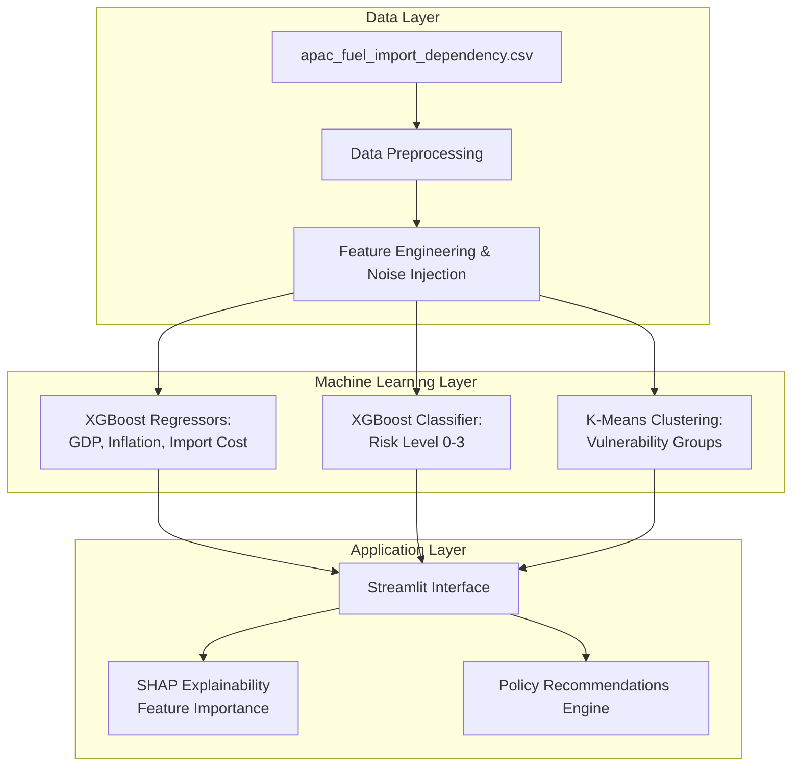
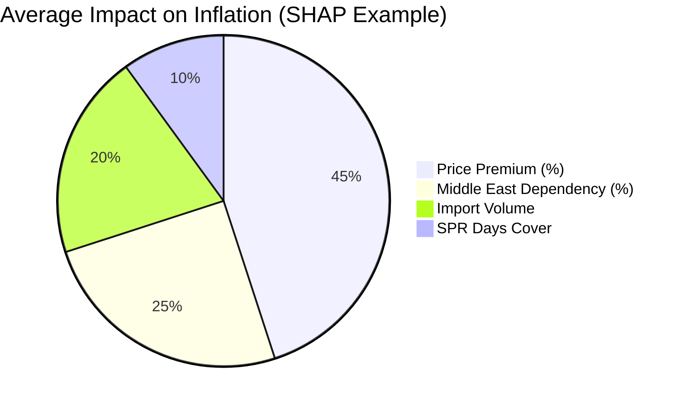
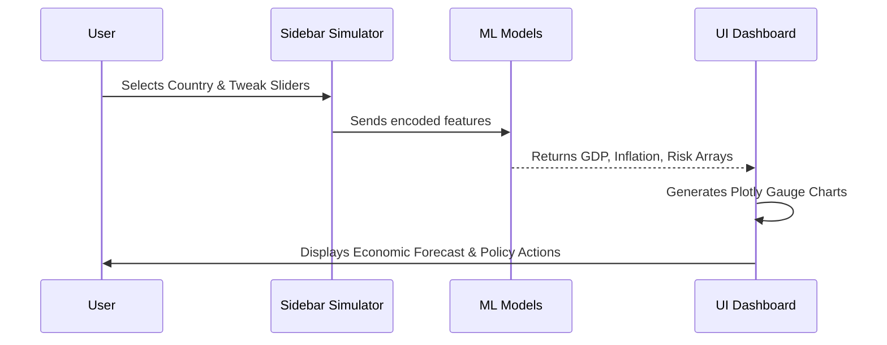

# 🌍 GeoImpact Risk Engine - Technical Documentation

## 1. Executive Summary
The **GeoImpact Risk Engine** is a predictive analytics and simulation platform built to model the macroeconomic consequences of geopolitical energy shocks in the APAC region. By leveraging Machine Learning (XGBoost & K-Means), the system forecasts inflation surges, GDP contractions, and import cost spikes based on user-defined conflict scenarios.

---

## 2. System Architecture

The following diagram illustrates the data flow from raw ingestion to the final interactive dashboard interface:

---

## 3. Data Dictionary
The core dataset simulates energy dependencies for 20 APAC countries.

| Feature | Type | Description |
| :--- | :--- | :--- |
| **Country** | Categorical | Target APAC Nation (e.g., Japan, India, China) |
| **Fuel_Type** | Categorical | Crude Oil, LNG, LPG, Diesel, Jet Fuel, Fuel Oil |
| **Conflict_Phase** | Categorical | The severity of the conflict (e.g., Initial Escalation, Maritime Blockade) |
| **Import_Volume_KBPD** | Numeric | Kilobarrels per day imported |
| **ME_Share_Pct** | Numeric | Percentage of fuel imported directly from the Middle East |
| **Alternative_Source_Pct**| Numeric | Percentage of fuel safely sourced from non-conflict regions |
| **Price_Premium_Pct** | Numeric | Global price spike percentage caused by the conflict |
| **SPR_Days_Cover** | Numeric | Strategic Petroleum Reserve capacity in days |
| **Disruption_Risk_Score** | Numeric | Baseline risk score (0-3) |

---

## 4. Machine Learning Pipeline Details

### 4.1. Synthetic Target Generation
Because historical data on massive geopolitical shocks is rare, the training pipeline (`ml_training.py`) uses carefully constructed formulas to simulate economic impacts, injecting Gaussian noise to prevent the models from memorizing rigid formulas.

### 4.2. Model Selection
1. **Regression Models (XGBRegressor):**
   * Chosen for its ability to handle non-linear relationships in tabular data without requiring feature scaling.
   * Targets: `Inflation_Impact`, `GDP_Impact`, `Import_Cost_Increase`
2. **Classification Model (XGBClassifier):**
   * Classifies the overall `Risk_Class` into 4 tiers: Low (0), Medium (1), High (2), Critical (3).
3. **Clustering (K-Means):**
   * `StandardScaler` normalizes the inputs before K-Means groups countries into 3 distinct vulnerability profiles based on `ME_Share_Pct`, `SPR_Days_Cover`, and `Disruption_Risk_Score`.

---

## 5. Explainable AI (SHAP)

To ensure the AI is not a "black box," the dashboard implements **SHAP (SHapley Additive exPlanations)**. 

*Note: SHAP dynamically calculates these exact weights for every specific "What-If" scenario the user runs, generating a waterfall chart in the UI.*

---

## 6. Business Logic & Thresholds

The policy recommendation engine is strictly grounded in real-world energy economics:

* **SPR Days < 60 (Critically Low):** The International Energy Agency (IEA) legally mandates member states to hold 90 days of net imports. Dropping below 60 signals catastrophic vulnerability to supply shocks.
* **Middle East Dependency > 40%:** Exceeding a 40% reliance on a single geopolitical chokepoint (like the Strait of Hormuz) triggers supply chain warnings, prompting diversification recommendations.
* **Price Premium > 30%:** Historical data (1973 Oil Crisis, 1990 Gulf War) shows that a sudden 30%+ price spike is the tipping point that historically triggers widespread domestic inflation and recession.

---

## 7. User Interface Flow

